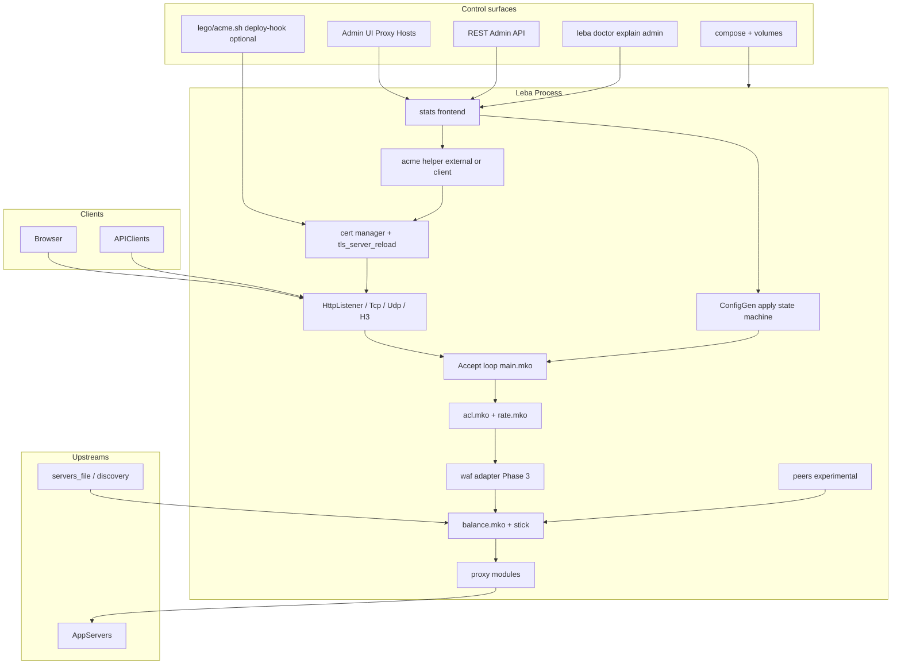
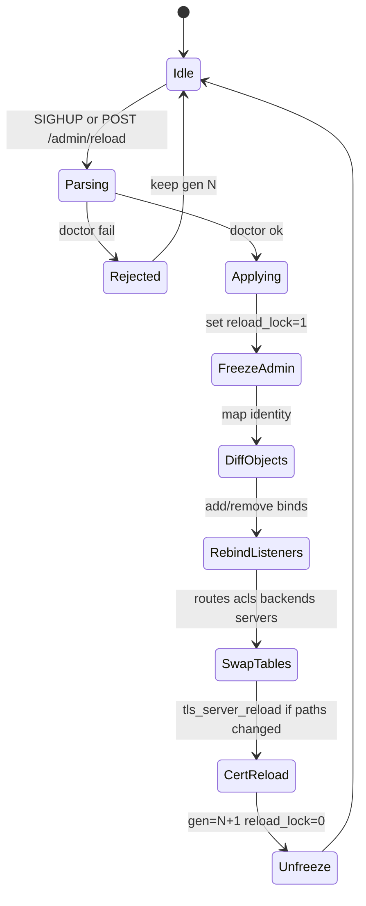
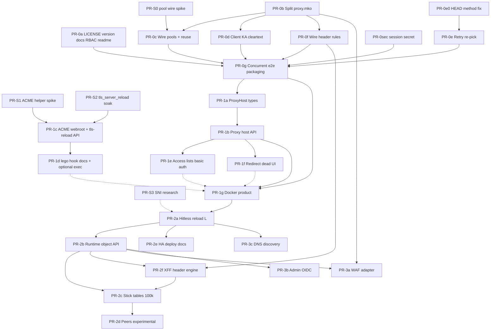

# Leba Competitive Product Architecture: Beat NPM + HAProxy Enterprise

| Field | Value |
|-------|-------|
| **Document** | Competitive Product Architecture |
| **Author** | TBD |
| **Date** | 2026-07-17 |
| **Status** | Draft (revision 3 — residual re-review issues addressed) |
| **Baseline** | Leba 0.7.1 (`main.mko` prints `leba 0.7.1`; `mako.toml` still says `0.1.0`) |
| **Audience** | Senior engineers shipping Leba as an open-core edge load balancer |

---

## Overview

Leba is a single-binary load balancer written in Mako. Its data plane is already competitive for a focused edge LB: HTTP/1–3, WebSocket, TCP, SIP/UDP signaling, multi-algorithm balancing, sticky cookies, drain/ready, active/passive health, TLS/mTLS, ACLs, rate limits, Prometheus, doctor/explain, and an RBAC admin UI. What blocks product-market displacement of Nginx Proxy Manager (NPM), NGINX Plus/One, and HAProxy Enterprise is not “more algorithms”—it is **day-1 UX (certs + proxy hosts + Docker)**, **operational hitlessness (full config reload + live cert swap)**, and **multi-node state (stick tables/peers + HA pair)**.

This document defines a phased architecture and an ordered PR plan to reach:

1. **Near-term:** “HAProxy-like power with NPM-like day-1 UX”
2. **Mid-term:** open-core edge LB that undercuts HAProxy Enterprise for ~80% of edge use cases
3. **Explicit non-claim:** do **not** market full HAProxy Enterprise replacement until hitless reload + multi-node state + a security module ship

All recommendations are grounded in the current code layout (`main.mko`, `src/proxy.mko` ~3.2k LOC, `src/admin.mko`, `src/config.mko`, `src/webadmin.mko`, `src/balance.mko`, etc.), Mako runtime constraints (crew workers, kick-safe args), and **actual Mako builtins** (`tls_server_reload`, `http_forward_fd` / `http_forward_full`, `tcp_pool_*`, `tls_make_csr`, `exec_run`/`exec_output`, `h3_server_*` without reload).

---

## Background & Motivation

### Current state (audit-aligned, code-verified)

| Area | Strength | Gap |
|------|----------|-----|
| Data plane | HTTP/1.1 reverse proxy, H2 over TLS, H3/QUIC when quiche-linked, WS tunnel, TCP, SIP Call-ID affinity | Buffered full-request model; no true streaming for large bodies |
| LB / ops | RR, least_conn, ip_hash, weighted, random, sip_call_id, sticky cookie, maxconn, drain fail-closed | Retries re-hit same `host:port` (`forward_http_retries`); no stick tables |
| TLS | Termination, mTLS admin, doctor path checks; Mako has **`tls_server_reload(server, cert, key)`** | Admin cert path updates set `restart_required_for_cert=true` and **never call** `tls_server_reload`; H3 has `h3_server_new` only (no reload); single cert per `HttpListener` |
| Reload | SIGHUP + file watch → `reload_servers_files` only | Full config reload not implemented (`docs/PAINPOINTS.md`); PAINPOINTS correctly marks watched servers_file as done (CONFIG_REFERENCE still stale) |
| HTTP quality | Structured logs, XFF flag, header rules **parsed** into `World.header_rules` | **Header rules never applied** — `apply_*_headers` exist but no dispatch/worker call site; production upstream is almost always **`http_forward_full` → HTTP/1.1 + Connection: close** because **`init_server_pools` is never called** (pool stays `-1`) |
| Upstream pool code | Workers already branch on `pool >= 0` → `http_forward_fd` (Mako builds **HTTP/1.1 + keep-alive**); `tcp_pool_release(pool, fd, ok)` gates reuse on success + fd probe | Pool path dead until wired; release uses `ok` only — no parse of upstream `Connection` header; test helper `upstream_http_request_text` (HTTP/1.0 close) is **not used in production** |
| Client responses | — | Always `Connection: close` in `raw_http_respond_full` / `tls_http_respond_full`; workers always close client fd |
| Admin UX | Dashboard, Proxy Hosts tab, vhost-create/cert, multi-cert SNI, RBAC | Not NPM-complete: no ACME product path, no access lists product surface |
| Packaging | systemd unit under `deploy/linux/` | **No LICENSE**, **no Dockerfile**, version drift, CONFIG_REFERENCE watcher drift |
| Enterprise | Single process, encrypted state_file, WAF, DNS resolve/expand/SRV, experimental stick peers, admin OIDC SSO | SAML; peers not production-hardened; OIDC without JWKS RS256 re-verify |

### Pain points operators feel today

1. **Cert rotation = process restart** — `POST /admin/vhost-cert` persists paths into `leba.vhosts.conf` but never calls Mako `tls_server_reload` on the live `HttpListener.tls_srv`.
2. **SIGHUP is not “reload config”** — only `reload_servers_files` (`main.mko` ~453–469).
3. **Upstream connection tax** — `init_server_pools` exists in `config.mko` but is **never invoked** from `main`/`parse_config_file`, so workers always take `forward_http` → `http_forward_full` (HTTP/1.1 + **close**). Pool+KA path is written but dormant.
4. **Retry does not re-pick** — `forward_http_retries` loops the same host/port.
5. **Header rules are config theater** — parsed into `World.header_rules`, helpers exist, never wired into Dispatch.
6. **proxy.mko concentration risk** — ~3177 lines; adversarial notes warn large Mako functions stress the compiler.
7. **Session secret hard-coded** — `session_secret()` = `sha256("leba-session-key-2026")` in `stats.mko`.

### Competitive pressure

| Competitor | Why users pick them | What Leba must match | What Leba can win on |
|------------|---------------------|----------------------|----------------------|
| **NPM (OSS)** | GUI, Let’s Encrypt, multi-host SNI, Docker one-liner | Cert issuance path, multi-host HTTPS (honest scope), Proxy Host CRUD, compose | Single binary, doctor/explain, real LB algorithms, drain correctness |
| **NGINX Plus / One** | Dynamic config, SSO, commercial support | Runtime object API, SSO later | Simpler config grammar, built-in explain |
| **HAProxy Enterprise** | Hitless reload, stick-table peers, WAF/bot, Fusion CP, LTS | Hitless reload, stick tables + optional peers, WAF path | Day-1 UX + doctor, open-core price, SIP niche |

---

## Goals & Non-Goals

### Goals

1. **Phase 0 Trust:** license, packaging, wire pools + header rules, client keep-alive, retry re-pick, concurrent tests.
2. **Phase 1 NPM killer:** cert UX (external ACME MVP → in-process later), live cert via `tls_server_reload`, Proxy Host resource, Docker compose, access lists/basic auth/redirect hosts. **Multi-host HTTPS scope is explicit (see D18).**
3. **Phase 2 LB platform:** hitless full config reload with a concrete ownership model, runtime object API, stick tables (+ experimental peers), HA pair design, XFF/header engine.
4. **Phase 3 Enterprise:** WAF adapter, OIDC admin SSO, service discovery.
5. Every phase ends with **measurable “beat” criteria** and acceptance tests.

### Non-Goals (this design window)

- Full HAProxy Enterprise feature parity.
- RTP/media relay.
- Replacing Mako with another language.
- Pure-Mako ACME JOSE without runtime crypto (impossible with current builtins — see D16).
- Inventing dual-context TLS free/refcount as the primary cert path (use `tls_server_reload` first — D17).
- Claiming “HAProxy Enterprise replacement” before H1–H4.

---

## Proposed Design

### Architecture principles

1. **Evolve in place** — extend `World`, listeners, admin handlers, accept loop in `main.mko`.
2. **Keep crew kick-safe** — workers take only ints/strings/channels (or deep-POD named structs of scalars/strings). Selection, ACL, header pre-render stay on the accept thread.
3. **Hot path size budget** — split `proxy.mko` before feature bulk; target modules ≤ ~800–1200 LOC.
4. **Config remains source of truth** — managed includes (`leba.vhosts.conf` / `leba.hosts.conf`).
5. **Use existing Mako APIs first** — `tls_server_reload`, `tcp_pool_*`, `http_forward_fd`, `tls_make_csr`, `exec_*`.
6. **Honesty in marketing** — gate enterprise and NPM claims on shipped multi-host/cert capabilities.

### High-level architecture (target)



### Current runtime loop (code reality)

```mermaid
sequenceDiagram
  participant Sig as signals HUP TERM INT
  participant Main as main.mko accept loop
  participant Watch as servers_file watch
  participant Reload as reload_servers_files
  participant Prep as prepare_raw_dispatch
  participant Pool as crew worker pool
  participant Up as worker_raw_upstream

  Sig->>Main: signal_fired HUP
  Watch->>Main: watch_poll path
  Main->>Reload: backends, servers, config_dir
  Reload-->>Main: new servers preserve runtime
  Main->>Main: accept fd / pending_clients
  Main->>Prep: ACL rate pick server
  Prep-->>Main: Dispatch need_worker
  Main->>Pool: pool.kick worker
  Note over Up: pool usually -1 today
  Up->>Up: http_forward_full close path
  Up-->>Main: done channel; worker closed client fd
```

---

## Phase 0 — Trust

**Intent:** Make 0.8.x a release people install. No competitive marketing until this lands.

### 0.1 License & version hygiene

- Add root `LICENSE` (**Apache-2.0** for core — D1).
- Align versions: `mako.toml`, `main.mko` version print, README, tags.
- Fix doc drift:
  - `docs/CONFIG_REFERENCE.md`: document `watch_available()` / `watch_add` path (code has it; PAINPOINTS already marks watched servers_file done).
  - README: `vhost-create` / `vhost-cert` require **operator** (all `POST /admin/*` → operator in `admin_path_required_role`), not admin.
- Note session secret issue (fixed in 0.1b / security PR).

### 0.2 Release packaging

```text
dist/
  leba-<ver>-linux-amd64
  leba-<ver>-linux-arm64
  leba-<ver>-darwin-arm64
  checksums.txt
Dockerfile
docker-compose.yml   # minimal in 0.8; product UX in 0.9
.github/workflows/ci.yml
```

### 0.3 Upstream connection reuse (corrected)

**Facts (verified):**

| Path | HTTP version | Connection | Used when |
|------|--------------|------------|-----------|
| `http_forward_fd` (Mako `mako_proxy.h`) | HTTP/1.1 | **keep-alive** | `pool >= 0` and acquire succeeds |
| `http_forward_full` | HTTP/1.1 | **close** (always closes fd) | fallback / retries |
| `upstream_http_request_text` in `proxy.mko` | HTTP/1.0 | close | **tests only** (`leba_core2_test.mko`) — not production |
| `init_server_pools` | opens `tcp_pool_open` | max = `server.maxconn` or 64, cap 256 | **defined, never called at runtime** |

**Work (do not “switch 1.0→1.1” on the wrong function):**

1. **Wire `init_server_pools`** after config load in `main.mko` (and after `reload_servers_files` for new servers). This alone activates the keep-alive pool path.
2. **Prefer pool always** for HTTP upstream: if `pool < 0`, open pool lazily or fail doctor warning; avoid `http_forward_full` except as last resort.
3. **Reusable flag correctness:** today workers pass `ok` to `tcp_pool_release`. Extend to parse upstream response headers (`http_forward_headers`) for `Connection: close` / HTTP/1.0 and set reusable=0; also reusable=0 on incomplete body, 5xx if policy says so.
4. **Config:** optional `pool_size N` overrides open max (see Issue 11 / section Data Model). Document relation: `pool_size` → `tcp_pool_open` max; if unset, keep `maxconn || 64` capped 256. Close pools with `tcp_pool_close` when server removed on reload **only after** no inflight worker still holds that pool id.
5. **Metrics:** `tcp_pool_idle` / `tcp_pool_open_count` already exist in Mako — expose as Prometheus gauges.
6. **Tests:** fix or retire assertions on HTTP/1.0 `upstream_http_request_text` if that helper is deleted; add pool-wired e2e.

**Optional later (Alternative I):** `http_proxy_raw` byte-pump for true connection reuse without rebuild — not required for 0.8 if pools are wired.

**Acceptance methodology (not 80-request flaky gate):**

| Experiment | Method | Target |
|------------|--------|--------|
| Upstream pool only | Client still close; origin counts connections | Origin TCP accepts ≈ unique connections ≪ request count; ≥ **2×** request throughput vs unwired baseline on same host with N≥5000 serial requests, warm process, 5 runs, report median |
| Full KA (after 0.4) | Client + upstream KA | Concurrent (50×100) RPS ≥ **3×** client-close+unpooled baseline; absolute RPS recorded |
| p99 | Same machine, small body | Document measurement script; budget **no more than +5 ms p99** vs baseline for small responses — informational, not sole release gate |

Do **not** gate release solely on `BENCH_REQUESTS=80` in `haproxy_compare.sh`.

### 0.4 Client keep-alive — FD ownership matrix

**Problem:** Today every worker closes the client: `worker_raw_upstream` → `tcp_close(c)`, `worker_upstream` → `http_close(c)`, WS/TCP workers close locally. All share one `done` channel in `main.mko`: `chan_open[(int,int,int,int,int)]`. After the channel grows, **close rules must not double-close**.

**Single close rule (PR-0d, mandatory):**

> **For cleartext HTTP data-plane fds returned on `done` with `client_fd >= 0`, the accept thread is the sole closer. Those workers never call `tcp_close` / `http_close` on the client fd (whether `keep_alive` is 0 or 1).**

| Protocol path | Phase 0 scope | Worker closes client? | `client_fd` on done | `keep_alive` | Who closes |
|---------------|---------------|----------------------|---------------------|--------------|------------|
| Cleartext HTTP/1.x (`worker_raw_upstream`, legacy `worker_upstream`) | **In scope** | **Never** | real fd | 0 or 1 | Accept: requeue if KA=1 and under cap; else `tcp_close` / `http_close_listener`-equivalent |
| Cleartext WS (`worker_ws_upstream`) | Out of KA | **Yes (local)** | **−1** | 0 | Worker (unchanged); accept ignores fd |
| TCP proxy (`worker_tcp_upstream`) | Out of KA | **Yes (local)** | **−1** | 0 | Worker |
| TLS HTTP / TLS WS | Defer KA | Worker still owns `TlsConn` free | **−1** | 0 | Worker (Phase 0); TLS KA later |
| HTTP/2, HTTP/3 | Existing multi-req | N/A | **−1** | 0 | Existing path — **H1 KA does not “fix” H2** |
| Stats frontend | Out of scope | Existing | N/A | — | May stay close |

**Done channel shape after PR-0d + PR-0e (kick-safe ints only):**

```text
// main.mko today:
//   chan_open[(int, int, int, int, int)]
//   recv: (err, status, server_idx, bytes, retries)
//   apply_done_servers(err, status, server_idx, bytes, servers)
//     → server_conn_delta(si, −1) + mark_req + passive health on that si

// After PR-0d + PR-0e:
//   chan_open[(int, int, int, int, int, int, int, int)]
//   fields:
//     err, status, conn_si, served_si, bytes, retries, client_fd, keep_alive
//
//   conn_si   = hop0 index that received +1 at dispatch (−1 if no server held)
//   served_si = hop that answered (or last attempted on total failure); −1 if none
//   client_fd = cleartext HTTP fd for accept-thread close/requeue; else −1
//   keep_alive = 1 only for cleartext HTTP when client+response allow reuse
```

**Accept thread on done (pseudocode):**

```text
d_err, d_st, d_conn_si, d_served_si, d_bytes, d_retries, d_fd, d_ka = done.recv()

// 1) Conn accounting: always −1 the slot we +1'd (hop0), never the hop that served
servers = apply_done_servers_conn(d_err, d_conn_si, servers)
//    apply_done_servers_conn: if d_conn_si >= 0 { server_conn_delta(si, −1) }

// 2) Stats + passive health on the hop that actually answered / last failed
servers = apply_done_servers_health(d_err, d_st, d_served_si, d_bytes, servers)
//    mark_server_req + apply_passive_health on d_served_si only (if >= 0)

st = apply_done(d_err, d_served_si, d_bytes, d_retries, servers, st)

// 3) Client FD — sole closer for cleartext HTTP (d_fd >= 0)
if d_fd >= 0 {
  if d_ka == 1 and pending under limit and max_keepalive_requests ok:
    requeue PendingClient{fd: d_fd, ...}
  else:
    tcp_close(d_fd)   // or http_close if legacy http_* fd type requires it
}
// if d_fd < 0: worker already closed (WS/TCP/TLS); do nothing
```

**Legacy `http_*` vs raw TCP:** `worker_upstream` uses `http_close(c)`; raw path uses `tcp_close(c)`. Accept thread must use the matching close for the fd kind stored on `PendingClient.kind` (already 1=stats, 2=http raw today). Document: raw cleartext → `tcp_close`; if any path still uses stdlib HTTP server fds → `http_close`. Prefer converging data plane on raw TCP + `tcp_close` only.

**Worker changes (cleartext HTTP only):**

1. Parse client want-KA (HTTP/1.1 default yes unless `Connection: close`).
2. Respond with `Connection: keep-alive` or `close` + Content-Length.
3. **Never** `tcp_close`/`http_close` the client fd.
4. `done.send((err, st, conn_si, served_si, bytes, retries, c, ka))` with `ka∈{0,1}`.

**Non-HTTP / TLS workers (migration):**

```text
// Unchanged close-in-worker behavior; signal accept not to touch fd:
done.send((err, st, conn_si, served_si, bytes, retries, -1, 0))
// then tcp_close / tls free as today
```

**Regression:** KA=0 cleartext must not double-close (ASan/crash). Test: force KA=0, many requests, process stays up; fd count stable.

**Slowloris / resource controls:**

- Idle timeout = `timeout_client_ms`.
- `max_keepalive_requests` default 1000.
- Pending cap `workers * 64`; metrics `leba_client_keepalive_requeues_total`, `leba_client_keepalive_rejects_total`.
- Rate limit on every requeued request.

```mermaid
sequenceDiagram
  participant Acc as Accept thread
  participant W as Cleartext HTTP worker
  participant Up as Upstream pool

  Acc->>Acc: server_conn_delta hop0 +1
  Acc->>W: kick fd + RetryPlan
  W->>Up: http_forward_fd hop0 then hop1
  Up-->>W: response
  W->>W: write client response
  W-->>Acc: done conn_si=hop0 served_si=hop1 fd=N ka=1
  Note over W: never closes client fd
  Acc->>Acc: conn_delta hop0 -1; health on hop1
  Acc->>Acc: requeue or tcp_close N
```

### 0.5 Retry re-pick — POD plan + conn_si / served_si

**Kick-safe types (no arrays across `pool.kick`):**

```text
struct RetryHop {
    host: string
    port: int
    pool: int
    server_idx: int
}

// Fixed-width plan — HOP_MAX = 4. Empty hops: server_idx = -1, pool = -1.
struct RetryPlan {
    n: int            // 1..4 hops populated
    h0: RetryHop      // primary; only hop that may hold maxconn
    h1: RetryHop
    h2: RetryHop
    h3: RetryHop
}

fn retry_plan_empty() -> RetryPlan {
    let z = RetryHop { host: "", port: 0, pool: -1, server_idx: -1 }
    return RetryPlan { n: 0, h0: z, h1: z, h2: z, h3: z }
}
```

Worker receives `plan: RetryPlan` (deep-POD of scalars/strings — Mako GUIDE OK). Iterate `i in 0..plan.n` selecting `h0`/`h1`/`h2`/`h3` by index (no hop array).

**Accept-thread plan build:**

1. Pick primary with sticky/balance (`pick_server` / sticky cookie) → `h0`.
2. Sticky eligible pin → `n=1` only; on sticky target failure, rebuild without sticky for alternates (policy: fail-through re-pick).
3. Else fill `h1..` up to `min(retries, 3)` more eligible servers excluding prior picks.
4. Dispatch: `server_conn_delta(+1)` **only** on `h0.server_idx` (if ≥ 0).

**Done-channel contract (must match `apply_done_*` split):**

| Field | Always | Used for |
|-------|--------|----------|
| `conn_si` | `plan.h0.server_idx` (or −1) | **Only** input to `server_conn_delta(−1)` — pairs the dispatch +1 |
| `served_si` | hop that returned ok, else last attempted, else −1 | `mark_server_req`, passive health, access log server id |
| `retries` | number of failed hops before success (or total fails) | `LiveStats.retries` |

**Event table (no leak):**

| Event | Dispatch | Done `conn_si` | Done `served_si` | conns result |
|-------|----------|----------------|------------------|--------------|
| hop0 success | +1 hop0 | hop0 | hop0 | −1 hop0; net 0 |
| hop0 fail, hop1 success | +1 hop0 | hop0 | hop1 | −1 hop0; hop1 never +1/−1 for maxconn; hop1 gets mark_req/health |
| all fail after hop0,1 | +1 hop0 | hop0 | last tried | −1 hop0; passive fail on `served_si` (and optional bit mask later) |

**D20 (clarified):** maxconn reservation is **only** hop0. Alternates are best-effort without maxconn slots. **`apply_done_servers` must be split** (or extended) so −1 uses `conn_si` and health/stats use `served_si` — today's single-`si` API cannot express hop1-served correctly.

**Blackhole unit test (PR-0e acceptance):**

1. Two servers; hop0 blackholed; hop1 serves 200; `retries >= 1`.
2. Assert `servers[hop0].conns` returns to pre-request baseline after done.
3. Assert `servers[hop1].conns` never elevated by this request’s maxconn path.
4. Assert hop0 or hop1 passive/error counters move appropriately (`served_si` / fail path).

**HEAD bug:** PR-0e0 — `worker_upstream` must pass real method into respond helpers, not hardcoded `"GET"`.

### 0.6 Header rules — wire into data plane

**Facts:** `World.header_rules` filled in `config.mko`; `apply_request_headers` / `apply_response_headers` in `proxy.mko`; **zero call sites** in `main` / prepare / workers.

**Design: accept-thread pre-render (kick-safe strings):**

1. Extend `Dispatch` with:
   - `up_headers: string` — final block for upstream (Host, Cookie, traceparent, client pass-through denylist, then `apply_request_headers` / del/add)
   - `resp_extra: string` — from `apply_response_headers` + will merge with `extract_pass_headers` on response in worker **or** pre-only response set/add (worker merges pass-through)
2. Build `up_headers` in `prepare_raw_dispatch` / TLS / H2 / H3 prepare paths **before** kick.
3. Worker uses `up_headers` instead of building Host/Cookie/trace only.
4. Response path: worker `extra_headers = extract_pass_headers(uph) + resp_extra` (or apply response rules after pass headers).

**Hop-by-hop denylist** (response + request): `connection`, `keep-alive`, `transfer-encoding`, `te`, `trailer`, `upgrade`, `proxy-connection`. Invert response whitelist → forward all others except hop-by-hop and hop-managed (`content-length` recomputed).

**Call sites checklist (PR-0f acceptance):**

| Path | Function | Wire headers |
|------|----------|--------------|
| Cleartext raw | `prepare_raw_dispatch` → `worker_raw_upstream` | yes |
| Legacy http_* | `prepare_dispatch` → `worker_upstream` | yes |
| TLS H1 | TLS prepare → `worker_tls_upstream` | yes |
| H2 | `handle_tls_h2_once` / H2 dispatch | yes |
| H3 | `handle_h3_proxy_request` | yes |
| WS | upgrade — only minimal hop headers | limited |

### 0.7 Concurrent e2e tests

| Suite | What |
|-------|------|
| Units | hop denylist, header rules applied in prepare, retry plan, pool init |
| `scripts/concurrent_smoke.sh` | 50 parallel × 20 req; 0 unexpected 502 |
| Bench harness | N≥5k, separate upstream-pool vs client-KA experiments |
| `haproxy_compare.sh` | keep behavioral compare; do not sole-gate on 80 serial req |

### 0.1b Session secret

- `session_secret` from `state_key` if set, else `LEBA_SESSION_SECRET` env, else generate once into state file; **remove** hard-coded `leba-session-key-2026`.

---

## Phase 1 — NPM Killer

### 1.1 Data model: Proxy Host

(Unchanged in spirit — compiles to route + backend + server + ACLs.) Managed file evolves `leba.vhosts.conf` → `leba.hosts.conf`.

### 1.2 Certificates & ACME (implementable strategy — D16)

**Mako crypto reality:**

| Available | Missing for pure ACME client |
|-----------|------------------------------|
| `sha256`, `hmac_sha256`, `jwt_sign` (HMAC) | General RSA/ECDSA sign for ACME JWS (ES256/RS256) |
| `tls_make_csr(csr_path, key_path, cn, bits)` | X.509 chain parse beyond PEM load into SSL_CTX |
| `tls_make_self_signed` | Account key JOSE |
| `exec_run` / `exec_output` | — |
| `tls_server_reload` | H3 cert reload API |

**Do not invent pure-Mako RSA for ACME.**

#### Default path (Phase 1 MVP): External ACME helper (H)

```text
Operator or container entrypoint:
  lego / acme.sh / certbot
    → writes PEMs under acme_storage
    → deploy-hook: authenticated tls-reload (see below)
```

Leba responsibilities MVP:

1. Serve HTTP-01 challenges from a directory (`acme_webroot` or `acme_storage/challenges`) — **already** exempts `/.well-known/acme-challenge/` from `redirect https` in `prepare_raw_dispatch`.
2. **`POST /admin/tls-reload`** → `tls_server_reload(listener.tls_srv, cert, key)` (role: **operator**).
3. Doctor checks: port 80 when ACME webroot enabled; cert paths readable.
4. UI: paste cert paths / “reload cert” / document lego compose service.

#### Deploy-hook auth (required on secured installs)

Admin routes use HTTP Basic / session when credentials are configured (`admin_auth_required`, `admin_users_file`). An unauthenticated `curl` to a production stats port **fails with 401**. Recommended m2m pattern for lego/certbot hooks:

| Practice | Detail |
|----------|--------|
| **Bind stats to localhost** | `frontend stats` / `bind 127.0.0.1:18404` (or Docker internal only) |
| **Hook credentials** | Operator user in `admin-users.conf`; hook reads `LEBA_ADMIN_AUTH=user:pass` from env file (same pattern as `deploy/linux/leba.env`) |
| **Sample hook** | Ship `deploy/docker/lego-deploy-hook.sh` and document in `docs/` |
| **CLI alternative** | `leba admin tls-reload FRONTEND [ADDR] [USER:PASS]` wrapping the same POST |

```bash
#!/bin/sh
# deploy/docker/lego-deploy-hook.sh — example only
# Env: LEBA_ADMIN_ADDR=127.0.0.1:18404  LEBA_ADMIN_AUTH=operator:secret
#      LEBA_TLS_FRONTEND=web  LEBA_TLS_CERT=...  LEBA_TLS_KEY=...
set -eu
ADDR="${LEBA_ADMIN_ADDR:-127.0.0.1:18404}"
AUTH="${LEBA_ADMIN_AUTH:?set LEBA_ADMIN_AUTH=user:pass}"
FE="${LEBA_TLS_FRONTEND:-web}"
CERT="${LEBA_TLS_CERT:?}"
KEY="${LEBA_TLS_KEY:?}"
curl -fsS -u "$AUTH" -X POST \
  "http://${ADDR}/admin/tls-reload?frontend=$(printf %s "$FE" | sed 's/ /%20/g')&cert=$(printf %s "$CERT" | sed 's|/|%2F|g')&key=$(printf %s "$KEY" | sed 's|/|%2F|g')"
```

**Optional later (not Phase 1 MVP):** path-scoped reload token (`tls_reload_token` in defaults) accepted as `Authorization: Bearer …` for hook-only access without a full operator password. Until then, localhost + Basic is the supported path.

PR-1c/1d acceptance includes: hook script in tree, compose example with `LEBA_ADMIN_AUTH`, and a doc section “ACME renew with auth.”

#### Optional path (Phase 1.1): In-process orchestrator via exec

`src/acme.mko` shells to **pinned** `lego` binary (bundled in Docker image, not pure Mako crypto):

```text
exec_run("lego --path ... --email ... --domains ... run")
// then tls_server_reload
```

CI: pebble + lego; image includes lego **or** CI service container.

#### Deferred path (Phase 1.2+ / Mako spike): Native JOSE

Spike PR-S1: Mako feature `jose_sign_es256` / RSA-PSS **or** document won’t land. Only then pure-Mako ACME client.

#### Challenge middleware order (checklist)

In `prepare_raw_dispatch` (and TLS/H2 equivalents), for path prefix `/.well-known/acme-challenge/`:

1. **Bypass** rate limit  
2. **Bypass** ACL deny  
3. **Bypass** basic auth / access_list  
4. **Bypass** force_ssl redirect (already partially done)  
5. **Bypass** WAF (Phase 3)  
6. Serve token file from webroot only (path traversal reject; stay under webroot)  
7. Never log token body at info level  

### 1.2b Live cert swap — use `tls_server_reload` (D17)

**Primary algorithm (HTTP/1 + H2 on `TlsServer`):**

```text
1. Validate new cert/key files (readable, optional openssl verify via exec)
2. rc = tls_server_reload(http_listeners[i].tls_srv, cert_path, key_path)
3. if rc != 0 → 500, keep old material (SSL_CTX unchanged on failure)
4. Update Frontend.tls_cert / tls_key paths; persist managed conf
5. restart_required_for_cert = false for this path
```

Mako implementation (`mako_tls_server_reload`): updates `SSL_CTX` in place via `SSL_CTX_use_certificate_file` / `PrivateKey_file` / `check_private_key`. **No free/replace of context required.**

**Active connections:** existing `TlsConn` / sessions keep prior cert material until renegotiation/new handshake — **expected and documented**. New handshakes use reloaded cert.

**Dual-context free/refcount:** **not** primary design; only fallback if spike proves `tls_server_reload` races under concurrent accept (spike PR-S2). Open Question 2 closed by D17.

#### H3 path (explicit scope)

| Mode | Behavior |
|------|----------|
| Frontend **without** H3 | Phase 1 full live reload via `tls_server_reload` |
| Frontend **with** H3 (`h3_server_new`) | **No** `h3_server_reload` in Mako. Phase 1: document **restart required for H3 cert** OR recreate: `h3_server_close` → `h3_server_new` → rebind → `evloop` replace fd — **brief QUIC downtime**. Spike PR-S2 documents chosen behavior. |
| Phase 1 exit | Live reload **required** for TLS TCP listeners; H3 may return `restart_required_for_h3: true` |

### 1.2c Multi-cert SNI vs NPM beat criteria (D18)

**Shipped (Mako 0.2.1 + Leba):** default `tls_cert`/`tls_key` per frontend plus
repeatable `tls_sni HOSTNAME CERT KEY` (exact or `*.example.com`). Runtime calls
Mako `tls_server_sni_add` on listener open / rebind / `/admin/tls-reload`.
Admin `vhost-create`/`vhost-cert` with hostname install SNI live.
**Historical note:** earlier designs assumed no multi-cert API; that is closed.

**Phase 1 honest beat criteria (chosen):**

| Approach | Phase | Notes |
|----------|-------|-------|
| **A. Multi-SAN / single cert per process bind** | **Phase 1 exit** | One LE cert with multiple SANs, or one host per deploy; NPM-like multi-host **names** on one cert |
| **B. Multi-cert SNI** | **Phase 1.5 / 0.10 blocking for full NPM parity** | Requires Mako `tls_server_add_cert` / SNI callback spike (PR-S3). Until then **do not** claim multi-distinct-cert on one :443 |

**N2/N3 adjusted:**

- N2: Create HTTPS proxy host(s) that share the frontend cert or multi-SAN — works without restart for path/backend changes; cert reload via `tls_server_reload`.
- N3: Issue/renew **one** cert (external lego) covering configured hostnames; live reload TCP TLS.
- N3b (full NPM): multi-cert SNI — tracked separately; blocks “complete NPM replacement” marketing, **not** 0.9 Docker product.

### 1.3 Proxy Host API / UI + RBAC matrix (Issue 12)

Match **current code default**: any `POST /admin/*` → **operator** (`admin_path_required_role`). README wrongly said admin for vhost — fix in PR-0a.

**Deliberate RBAC matrix (Phase 1):**

| Action | Role |
|--------|------|
| GET proxy-hosts, certificates, access-lists | viewer |
| POST/PUT/DELETE proxy-hosts, enable/disable | **operator** |
| POST tls-reload | **operator** |
| Certificate **issue** (trigger lego), access-list write, http-auth user write | **admin** |
| Full config reload (`POST /admin/reload`) | **admin** |
| Admin user management | **admin** |

Implement via explicit path checks in `admin_path_required_role` (stop treating all POST as operator for sensitive routes).

### 1.4–1.6 Access lists, redirect/dead hosts, Docker

As before; Docker product **not** blocked on full ACME client — compose can ship with mounted certs + lego sidecar (PR-1g decoupled).

---

## Phase 2 — LB Platform

### 2.1 Hitless full config reload — ownership model (no fake atomics)

Mako `World` is a **value struct**. Runtime state lives as **locals in `main()`** (`servers`, `backends`, `frontends`, `routes`, `acls`, `http_listeners`, `slots`, `crew pool`). Workers hold **scalar copies** (`server_idx`, host, port, pool) and may outlive a generation.

**Do not** describe “atomic pointer swap.” Describe a **single-threaded apply on the accept loop**.

#### Types

```text
struct ConfigGen {
    gen: int
    // snapshots applied only on accept thread
}

// Apply phases
// 1. parse + doctor off-thread or sync on admin request
// 2. build DesiredConfig value
// 3. accept loop runs apply_config_gen(current, desired) → new locals
```

#### State machine



#### Identity & inflight rules

| Concern | Rule |
|---------|------|
| Server identity | Map by `(backend, name)` like `preserve_server_runtime`; preserve `alive/drain/conns/pool` when addr unchanged |
| Addr change | New pool via `tcp_pool_open`; **delay** `tcp_pool_close(old)` until no inflight worker references old pool id (refcount map `pool → inflight` maintained on kick/+done) |
| `server_idx` stale | Workers may finish with old index; accept thread translates via gen-scoped map or ignores stats if index OOB; prefer stable identity table not raw vector index long-term |
| Listen fd remove | Stop `evloop` accept; **do not close** until `inflight_by_frontend[fe]==0` and pending_clients for that fe drained |
| Listen fd add | `tcp_listen` + `evloop_add` |
| Admin mutations | If `reload_lock`, return 503 `reload_in_progress` on mutating admin |
| `workers` change | **Restart required** (document); do not resize crew mid-flight in v1 |
| Stats path | Same locals; apply only on accept thread between accept iterations (existing pattern for admin returns new slices) |
| Feature flag | `defaults reload full\|servers` (D2); default `servers` until soak, then `full` |

#### Estimate

PR-2a is **L (1–2 weeks)**, not 1–3 days. Split: 2a1 parse+doctor+flag, 2a2 table swap, 2a3 listener rebind, 2a4 pool lifecycle.

### 2.2 Full runtime object API

As before; roles per matrix.

### 2.3 Stick tables (implementable v1)

**v1:** `map[string]StickEntry` on accept thread only (matches pick model). Lazy expire in health tick.

**Acceptance:** **100k entries** first (not 1M). Benchmark harness optional; 1M / p99&lt;50µs is **aspirational design target**, not release gate.

**Cookie stick vs table:**

| Mechanism | Precedence |
|-----------|------------|
| Sticky cookie (`Frontend.sticky_cookie`) | If present and eligible server → wins |
| Stick table match | Else if table hit → use stored server if eligible |
| Balance algorithm | Else pick + optional stick store |

### 2.4 Peers (experimental)

Not production-required for Phase 2 exit.

**Message types (minimum):**

1. `HELLO` — node_name, cluster_name, gen  
2. `STICK_UPSERT` — table, key, server, version, expires_ms  
3. `STICK_DELETE`  
4. `FULL_SYNC_REQ` / `FULL_SYNC_CHUNK`  
5. `GOODBYE`

**Auth:** shared `peers_secret` HMAC or mTLS later.  
**Where serviced:** peer TCP client/server fds on **accept loop** `evloop` (not crew) to avoid map races.  
**Flag:** `peers` section enables experimental; default off.

### 2.5 HA pair + XFF engine

External VRRP (unchanged). XFF engine PR-2f should land **before** trusting stick-on-src behind proxies — **DAG: 2f before or with 2c for IP stick behind LB**. Cookie stick independent.

### 2.5b SO_REUSEPORT hot restart (Alternative J)

Interim hitless: double process + SO_REUSEPORT — optional ops doc, not core code path for 2a.

---

## Phase 3 — Enterprise

### 3.1 WAF adapter — integration contract

**Transport:** HTTP loopback or Unix socket.

```text
POST /v1/inspect
Headers: X-Leba-Request-Id, Content-Type: application/octet-stream (raw HTTP request)
Body: full raw request (Leba already buffers — good)
Response:
  200 {"action":"allow"}
  200 {"action":"block","status":403,"rule":"..."}
  503 → fail-open if waf_mode=detect; fail-closed if waf_mode=block and waf_fail=closed
Timeout: min(50ms default, timeout_client budget fraction)
```

Compose: Coraza/crs sidecar. **Does not depend on peers.**

### 3.2 OIDC — needs configurable session secret (0.1b)

### 3.3 DNS discovery — as before

---

## API / Interface Changes

### Existing (keep)

```text
GET  /admin/servers
POST /admin/{drain|ready|disable|enable}/{be}/{srv}
POST /admin/reload-servers
GET  /admin/vhosts
POST /admin/vhost-create      # operator
POST /admin/vhost-cert        # operator today; prefer tls-reload after
GET  /admin/config
GET  /stats /metrics /readyz /livez
```

### New (phased)

```text
# Phase 0/1
POST /admin/tls-reload?frontend=NAME   # operator — calls tls_server_reload
GET/POST/PUT/DELETE /admin/proxy-hosts[/{id}]
GET /admin/certificates
POST /admin/certificates/{name}/issue  # admin — triggers lego/exec
POST /admin/certificates/{name}/renew  # admin
GET/POST /admin/access-lists           # write admin
GET/POST /admin/http-auth              # write admin

# Phase 2
POST /admin/reload                     # admin — full gen apply
GET  /admin/runtime
GET  /admin/stick-tables
...
```

### Config grammar (delta)

```text
defaults
  pool_size 64              # optional override for tcp_pool_open max
  reload servers|full
  session_secret ...        # or env
  acme_webroot /var/lib/leba/acme/challenges
  acme_storage /var/lib/leba/acme
  acme_helper lego           # external binary name for Phase 1.1

# multi-SAN single cert Phase 1; tls_sni multi-cert only after Mako SNI
```

---

## Data Model Changes

- `pool_size` on defaults/backend; `init_server_pools` uses it when set.
- ProxyHost / Certificate / AccessList as before.
- `ConfigGen` / reload_lock / pool inflight refcounts for Phase 2.
- StickEntry map for Phase 2.
- Migration: `leba.vhosts.conf` → `leba.hosts.conf`.

---

## Alternatives Considered

### A. Full process restart for every config change  
**Verdict:** Reject as strategy; keep for hard changes.

### B. Second control process (NPM-style DB + nginx)  
**Verdict:** Reject for core.

### C. Embed HAProxy / OpenResty  
**Verdict:** Reject.

### D. Stick tables local-first vs peers-first  
**Verdict:** Local first; peers experimental.

### E. WAF in-process vs sidecar  
**Verdict:** Sidecar first.

### F. Client keep-alive vs H2-only  
**Verdict:** H1 KA still required for cleartext and many clients.

### G. `tls_server_reload` in-place vs dual-context free/refcount  
**Verdict:** **Prefer G (`tls_server_reload`)** — already in Mako (`mako_tls_server_reload` updates SSL_CTX). Dual-context only if spike fails. (Addresses review Issue 2/14.)

### H. External ACME (certbot/lego deploy-hook → tls-reload) vs pure-Mako ACME client  
**Verdict:** **H is Phase 1 MVP.** Pure-Mako client blocked on JOSE sign; exec-wrapped lego is 1.1; native JOSE needs Mako spike. (Issue 1/14.)

### I. `http_proxy_raw` byte-pump for reuse without rebuild  
**Verdict:** Optional optimization after pools wired; not Phase 0 critical path.

### J. Multi-process hot restart with SO_REUSEPORT  
**Verdict:** Ops interim for hitless before 2a matures; document only.

---

## Security & Privacy Considerations

| Threat | Mitigation |
|--------|------------|
| Admin API takeover | RBAC matrix; private bind; mTLS option |
| Hard-coded session secret | Config/env/state_key (0.1b) |
| ACME webroot traversal | Canonicalize under webroot; reject `..` |
| Challenge abuse | Middleware bypass list only for well-known path; body size limit on token |
| Cert APIs | Never return PEM private keys; absolute path checks under storage |
| Stick table IPs | Memory + expire |
| WAF | fail-open detect default |
| exec ACME helper | Pin binary path; no shell interpolation of domain into unquoted strings |

---

## Observability

Metrics: pool idle/open, client KA requeues, retry repick, config gen, tls_reload total, acme helper results, stick entries, waf blocked.

Doctor: pool init present, session secret not default, acme webroot, H3 restart warning on cert change.

---

## Rollout Plan

| Feature | Default | Notes |
|---------|---------|-------|
| `init_server_pools` | on | always after 0.8 |
| Client KA cleartext | on | TLS KA later if needed |
| `reload` | servers | full when stable |
| External ACME docs | — | lego compose profile |
| Multi-cert SNI | off | until Mako API |
| Peers | off | experimental |
| WAF | off | |

Rollback: binary replace; `reload servers`; prior cert files + tls-reload.

---

## Risk Analysis

| Risk | Severity | Mitigation |
|------|----------|------------|
| Mako large-function compiler | High | Split proxy.mko first |
| ACME without JOSE | High | External helper MVP (D16) |
| H3 no reload | Med | Document restart; optional recreate |
| Multi-cert SNI missing | High for full NPM | Honest Phase 1 scope (D18) |
| Hitless ownership bugs | High | State machine; long PR-2a; flag |
| Client KA FD leaks | Med | Caps, idle timeout, metrics |
| `init_server_pools` never called | High (perf) | Wire in PR-0c — actual root cause |
| Header rules unwired | Med | PR-0f call-site checklist |
| Peer protocol half-baked | Med | Experimental flag; 100k local first |

---

## Competitive Differentiation

Win now: doctor, explain, drain fail-closed, single binary, SIP affinity, RBAC admin.  
Parity: cert UX, Docker, hitless reload, stick tables.  
Avoid: Enterprise replacement claims; multi-cert NPM parity until SNI.

---

## Explicit “Beat” Criteria

### vs NPM

| # | Criterion | Done when |
|---|-----------|-----------|
| N1 | Install | `docker compose up` published image |
| N2 | Proxy host CRUD | GUI/API HTTPS host to upstream &lt; 5 min (shared/multi-SAN cert OK) |
| N3 | Cert renew | External or helper issue + **`tls_server_reload` without process restart** (TCP TLS) |
| N3b | Multi-cert SNI | **Separate** — full NPM parity; requires Mako SNI |
| N4 | Access list + basic auth | per host |
| N5 | Beyond NPM | least_conn, drain, doctor |

### vs NGINX Plus

P1 hitless reload, P2 runtime API, P3 observability; P4 SSO Phase 3.

### vs HAProxy Enterprise

H1 hitless, H2 stick local (100k), H3 HA docs + optional peers experimental, H4 WAF adapter. Marketing gate: H1–H4 + honesty on peers experimental.

---

## Key Decisions

| ID | Decision | Rationale |
|----|----------|-----------|
| D1 | Apache-2.0 core Phase 0 | LICENSE missing; adoption |
| D2 | SIGHUP servers-only until `reload full` flag stable | Avoid mid-Phase-0 breakage |
| D3 | Retry re-pick via POD `RetryHop` plan | Kick-safe; no `[]Server` |
| D4 | Response header denylist + **wire rules on accept thread** | Rules currently never applied |
| D5 | Proxy Host compiles to route+backend+server | Extends vhost pattern |
| D6 | HTTP-01 first | Fits port 80 + existing exempt path |
| D7 | **Live cert via `tls_server_reload`** | Mako already implements in-place SSL_CTX reload |
| D8 | Stick local-first; peers experimental | Ship value; protocol incomplete |
| D9 | HA via external VRRP | Scope control |
| D10 | WAF sidecar adapter | Faster; no peers dependency |
| D11 | Split `proxy.mko` first | Compiler risk |
| D12 | No Enterprise replacement claim before H1–H4 | Credibility |
| D13 | Wire pools + client KA in Phase 0 | Real perf path; not “change 1.0 string” |
| D14 | Docker in 0.8 skeleton / 0.9 product | NPM users |
| D15 | Managed includes as source of truth | Gitops |
| D16 | **ACME = external lego/acme.sh MVP; exec optional; no pure-Mako JOSE** | No RSA/ECDSA sign in Mako |
| D17 | **`tls_server_reload` primary; H3 restart/recreate documented** | Matches builtins; no dual-context first |
| D18 | **Phase 1 = multi-SAN/single cert; multi-cert SNI blocks full NPM claim** | No SNI multi-cert API yet |
| D19 | **RBAC: operator for host CRUD/tls-reload; admin for issue/users/full reload** | Align code; tighten sensitive ops |
| D20 | **Conn accounting: maxconn holds hop0 only; done carries `conn_si` (always hop0 for −1) and `served_si` (health/stats)** | Matches `apply_done_servers` split; prevents maxconn leak when hop1 serves |
| D21 | **Accept thread is sole closer for cleartext HTTP client fds on done (`client_fd>=0`); workers never close those fds** | Prevents double-close; WS/TCP/TLS send `client_fd=-1` and close locally |
| D22 | **External ACME hooks use localhost stats + HTTP Basic (`LEBA_ADMIN_AUTH` operator); sample deploy-hook shipped** | Secured installs 401 unauthenticated curl |

---

## Open Questions

1. Open-core module boundary (WAF/CP paid?) — product; **needs-user-input** for packaging, not Phase 0.  
2. ~~TLS free/replace safety~~ → **Resolved D17** (`tls_server_reload`).  
3. JSON vs query for proxy-host API — prefer JSON bodies in 0.9; query alias for vhost compat.  
4. ~~Multi-cert SNI 0.9 vs 0.10~~ → **Resolved D18** (after Mako SNI; not Phase 1 exit).  
5. Stick persistence across restart? Default no for v1.  
6. H3 recreate vs restart-only on cert change — spike PR-S2 chooses; default restart_required_for_h3.  
7. Bundle lego in official image vs document-only? Prefer **bundle in Docker image**, not in bare binary.

---

## Spike appendix (required before Phase 1 exit)

| Spike | Goal | Exit criteria | Effort |
|-------|------|---------------|--------|
| **PR-S0** | Confirm production pool path | Call `init_server_pools`; measure origin connection count | S (1–2 d) |
| **PR-S1** | ACME crypto options | Document lego deploy-hook e2e; reject pure-Mako JOSE | S–M |
| **PR-S2** | `tls_server_reload` under concurrent handshakes + H3 behavior | Soak reload during ab/curl; decide H3 recreate | M (3–5 d) |
| **PR-S3** | Multi-cert SNI Mako API | Prototype or defer with written limitation | M–L |

---

## References

- `/Users/loreste/leba/main.mko` — accept loop, SIGHUP, crew  
- `/Users/loreste/leba/src/proxy.mko` — workers, header helpers (unwired), ACME path exempt  
- `/Users/loreste/leba/src/config.mko` — `init_server_pools` (unwired), `World.header_rules`  
- `/Users/loreste/leba/src/admin.mko` — vhost, restart_required_for_cert  
- `/Users/loreste/leba/src/stats.mko` — RBAC, session_secret  
- `/Users/loreste/mako/runtime/mako_tls.h` — `mako_tls_server_reload`, `tls_make_csr`  
- `/Users/loreste/mako/runtime/mako_proxy.h` — `http_forward_fd` keep-alive, `http_forward_full` close, `tcp_pool_*`  
- `/Users/loreste/mako/docs/BUILTINS.md` — builtin signatures  
- Docs: PAINPOINTS, ADMIN_API, CONFIG_REFERENCE, SECURITY, ADVERSARIAL_REVIEW  

---

## PR Plan

Estimates: **S** = 1–2 days, **M** = 3–5 days, **L** = 1–2 weeks. Not every PR is 1–3 days.



### Spikes

#### PR-S0: Wire and measure server pools — **S**
- **Files:** `main.mko`, `src/config.mko`, bench script  
- **Dependencies:** none  
- **Description:** Call `init_server_pools` after load/reload; confirm `http_forward_fd` path; baseline connection reuse metrics.

#### PR-S1: ACME strategy spike — **S–M**
- **Files:** `docs/` design note, sample lego compose, pebble CI sketch  
- **Dependencies:** none  
- **Description:** Prove lego → PEM → future tls-reload; reject pure-Mako JOSE without runtime support.

#### PR-S2: `tls_server_reload` soak + H3 policy — **M**
- **Files:** small harness, docs  
- **Dependencies:** none  
- **Description:** Concurrent handshakes during reload; define H3 restart_required vs recreate.

#### PR-S3: Multi-cert SNI research — **M–L**
- **Files:** Mako issue / spike  
- **Dependencies:** none  
- **Description:** Feasibility of SNI multi-cert; blocks N3b only.

### Phase 0

#### PR-0a: License, version, doc drift, README RBAC — **S**
- **Files:** `LICENSE`, `mako.toml`, README, CONFIG_REFERENCE, ADMIN_API, PAINPOINTS  
- **Dependencies:** none  
- **Description:** Apache-2.0; version align; watcher docs; operator vs admin accuracy.

#### PR-0b: Split `proxy.mko` — **M**
- **Files:** `src/proxy*.mko`, `src/headers.mko`, `main.mko` pulls, tests  
- **Dependencies:** none  
- **Description:** Mechanical split; no behavior change.

#### PR-0c: Wire pools + upstream reuse correctness — **M**
- **Files:** `main.mko`, `src/config.mko`, workers, metrics, tests  
- **Dependencies:** PR-S0, PR-0b  
- **Description:** Always init pools; parse Connection for reusable; `pool_size` override; pool close on server delete when safe; metrics from `tcp_pool_idle`/`open_count`.

#### PR-0d: Client keep-alive cleartext — **M**
- **Files:** workers, `main.mko` done handling, `RawRequest`, `runtime.mko`, tests  
- **Dependencies:** PR-0b  
- **Description:** **D21** sole-closer rule; done tuple adds `client_fd`+`keep_alive`; cleartext HTTP workers never close client fd; WS/TCP/TLS send `client_fd=-1` and close locally; idle/max_requests caps; no double-close regression.

#### PR-0e0: HEAD method fix — **S**
- **Files:** `worker_upstream` respond path, test  
- **Dependencies:** none  
- **Description:** Pass real method, not `"GET"`.

#### PR-0e: Retry re-pick plan — **M**
- **Files:** prepare dispatch, workers, `runtime.mko` (`apply_done_servers` split), balance helpers, tests  
- **Dependencies:** PR-0e0 (not PR-0c); coordinate done-tuple with PR-0d if both land  
- **Description:** `RetryPlan` fixed-width POD (`h0..h3`,`n`); done `conn_si`/`served_si` (**D20**); blackhole test asserts hop0 conns baseline after hop1 success.

#### PR-0f: Wire header rules + denylist — **M**
- **Files:** `headers.mko`, all prepare paths (raw/TLS/H2/H3), doctor, tests  
- **Dependencies:** PR-0b  
- **Description:** Pre-render into Dispatch; call-site checklist acceptance; del/add complete.

#### PR-0sec: Configurable session secret — **S**
- **Files:** `stats.mko`, config, SECURITY.md, tests  
- **Dependencies:** none  
- **Description:** Remove hard-coded secret; state_key/env.

#### PR-0g: Concurrent e2e + packaging — **M**
- **Files:** scripts, Makefile, Dockerfile skeleton, CI  
- **Dependencies:** PR-0a, PR-0c, PR-0d, PR-0e, PR-0f, PR-0sec  
- **Description:** Concurrent smoke; bench methodology N≥5k; release tarball.

### Phase 1

#### PR-1a: ProxyHost types + parse — **M**
- **Dependencies:** PR-0g  
- **Files:** types, config, doctor, CONFIG_REFERENCE  

#### PR-1b: Proxy host API + persist — **M**
- **Dependencies:** PR-1a  
- **Files:** admin, stats RBAC matrix, webadmin, tests, ADMIN_API  

#### PR-1c: ACME webroot serve + `/admin/tls-reload` — **M**
- **Dependencies:** PR-S1, PR-S2, PR-0g  
- **Files:** proxy challenge serve, admin tls-reload → `tls_server_reload`, H3 flag in JSON, deploy-hook auth docs  
- **Description:** Not a full ACME client. Live reload TCP TLS. Operator Basic auth; localhost bind guidance (**D22**).

#### PR-1d: lego/acme.sh integration docs + optional exec helper — **M**
- **Dependencies:** PR-1c  
- **Files:** `deploy/docker/lego-deploy-hook.sh`, compose lego **profile** (optional), `src/acme.mko` exec wrapper optional, doctor  
- **Description:** Soft-enhances Docker product; **not** a hard dependency of PR-1g.

#### PR-1e: Access lists + HTTP basic — **M**
- **Dependencies:** PR-1b  

#### PR-1f: Redirect/dead hosts + UI polish — **S–M**
- **Dependencies:** PR-1b  

#### PR-1g: Docker product — **M**
- **Dependencies:** **PR-0g, PR-1b only** (hard). Soft/optional: PR-1d (lego profile), PR-1e/1f (richer demo).  
- **Description:** npm-like compose with **mounted certs** works without LE; optional compose profile adds lego+hook when 1d merges. Beat N1/N2.

### Phase 2

#### PR-2a: Hitless full config reload — **L** (split 2a1–2a4 if needed)
- **Dependencies:** PR-1g  
- **Files:** main, config, admin, runtime, e2e  
- **Description:** ConfigGen state machine; freeze admin; identity map; delayed listen/pool close; flag D2.

#### PR-2b: Runtime object API — **M**
- **Dependencies:** PR-2a  

#### PR-2f: XFF / header engine tokens — **M**
- **Dependencies:** PR-0f, PR-2b  
- **Description:** Before IP stick-behind-proxy reliance.

#### PR-2c: Local stick tables (100k) — **M–L**
- **Dependencies:** PR-2b, PR-2f (for safe src stick)  
- **Description:** map + expire; cookie precedence; metrics.

#### PR-2d: Peers experimental — **L**
- **Dependencies:** PR-2c  
- **Description:** 5 message types; accept-loop peer fd; default off.

#### PR-2e: HA pair deploy pack — **S**
- **Dependencies:** PR-2a  
- **Description:** keepalived examples only.

### Phase 3

#### PR-3a: WAF adapter — **M–L**
- **Dependencies:** PR-0b, PR-2b (**not** peers)  
- **Description:** HTTP inspect contract; detect fail-open; compose sidecar.

#### PR-3b: Admin OIDC — **L**
- **Dependencies:** PR-2b, PR-0sec  

#### PR-3c: DNS discovery — **M**
- **Dependencies:** PR-2a  

---

### Suggested merge milestones

| Milestone | Tag | Includes |
|-----------|-----|----------|
| Trust | `v0.8.0` | Spikes S0 + PR-0a…0g |
| NPM-useful | `v0.9.0` | PR-1a…1g (multi-SAN/external ACME; not N3b) |
| Platform | `v0.10.0` | PR-2a…2f (peers experimental) |
| Enterprise modules | `v1.1.0+` | PR-3a…3c; N3b if S3 done |

---

### Revision history

| Rev | Date | Notes |
|-----|------|-------|
| 1 | 2026-07-17 | Initial draft |
| 2 | 2026-07-17 | Address design review: ACME external, tls_server_reload, SNI scope, pool wiring truth, header wire-up, ConfigGen ownership, client KA FD matrix, retry accounting, realistic PR sizes, stick 100k, alternatives G–J, RBAC, session secret, WAF contract |
| 3 | 2026-07-17 | Residual re-review: `conn_si`/`served_si` done tuple + apply_done split; sole-closer D21; RetryPlan fixed-width kick payload; PR-1g DAG soft edges; deploy-hook Basic auth D22 |

---

*End of design document.*
